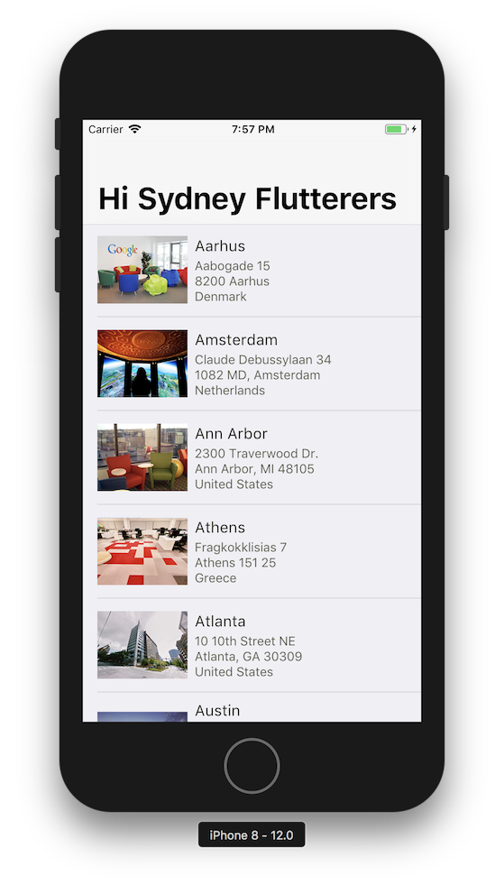

# Week 1, Step 4

A fourth step in building a Flutter application. A Cupertino themed app,
with content loaded over the network.



## Getting Started

I'm assuming you already have a working Flutter installation. If not,
please see the [Flutter documentation](https://flutter.io/) for a guide
to setting up Flutter on your machine.

To use this code sample, have Flutter create the missing `ios` and `android`
directories. These contain the code for running our flutter sample on the
respective platforms.

```bash
$ flutter create .
Creating project ....
[...]
Wrote 50 files.

[✓] Flutter is fully installed. (Channel dev, v0.9.3, on Mac OS X 10.13.6 17G65, locale en-US)
[✓] Android toolchain - develop for Android devices is fully installed. (Android SDK 28.0.2)
[✓] iOS toolchain - develop for iOS devices is fully installed. (Xcode 10.0)
[✓] Android Studio is fully installed. (version 3.1)
[✓] IntelliJ IDEA Community Edition is fully installed. (version 2018.1)
[✓] VS Code is fully installed. (version 1.27.2)
[✓] Connected devices is fully installed. (1 available)

All done! In order to run your application, type:

  $ cd .
  $ flutter run

Your main program file is lib/main.dart in the . directory.
```

You can now run this sample:

```bash
$ flutter run
Launching lib/main.dart on iPhone 8 in debug mode...
Starting Xcode build...
 ├─Assembling Flutter resources...                   1.8s
 └─Compiling, linking and signing...                 3.3s

Xcode build done.                                           10.8s
Syncing files to device iPhone 8...                         1.6s

🔥  To hot reload changes while running, press "r". To hot restart (and rebuild state), press "R".
An Observatory debugger and profiler on iPhone 8 is available at: http://127.0.0.1:62506/
For a more detailed help message, press "h". To detach, press "d"; to quit, press "q".
```

You can also run the test:

```bash
$ flutter test
00:06 +1: All tests passed!
```