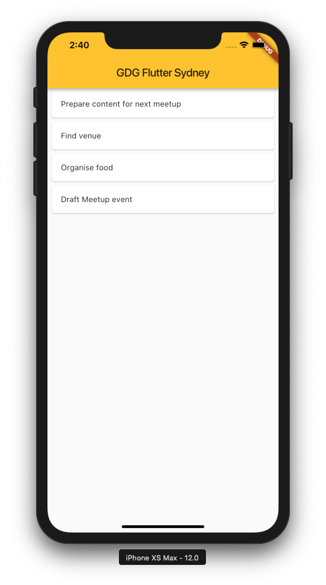

# Week 2, Step 0

This is the starting point for this week's session.

It's simple Material themed app with a `ListView` and some `Cards` displaying a hardcoded list of todos.

When you run this on an emulator/simulator you should have something like the screenshot below. Continue to Step 1

