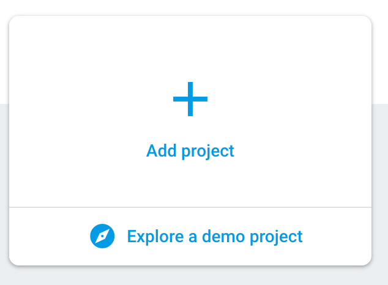
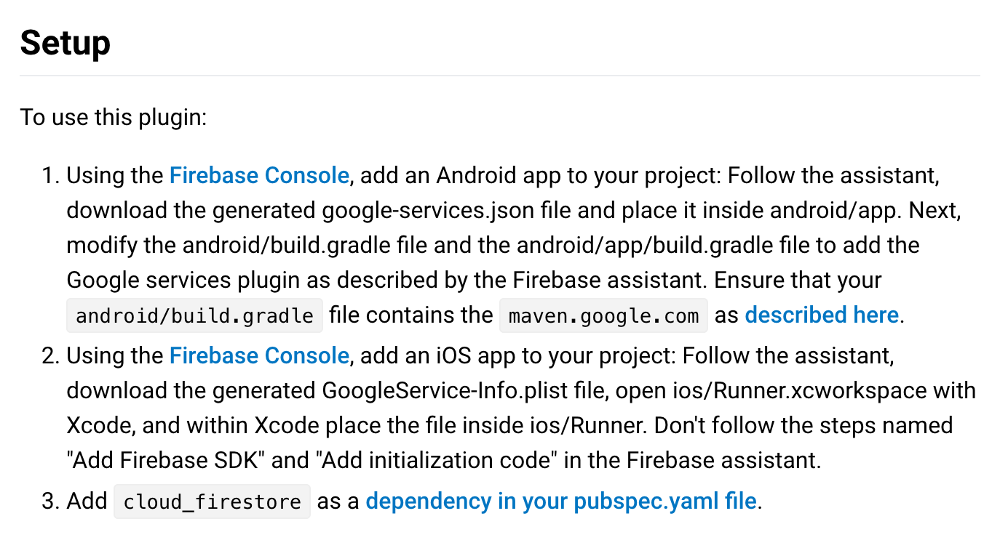

# Week 2, Step 2

Step 2 is setting up all the dependencie sto store data in Firebase.

*Note: If you're using this, you will still need to add the firebase config files: `google-services.json` and `GoogleService-Info.plist`*

Having a Todo app that stores your todo's locally is great. But it would be better is this was stored online so we can sync the data across multiple devices and maybe even a website!

We're going to prepare our Flutter app so it can communicate with [Firebase Cloud Firestore](https://firebase.google.com/products/firestore/). To make this work we have to do 2 things; Create a new Firebase project and configure our app to use that new project.

Go to the [Firebase Console](https://console.firebase.google.com/) and create a new project. 

Once that's set up go to `Database` and select `Cloud Firestore` as your database option.

To use Firebase in a Flutter app we can make use of [packages](https://flutter.io/using-packages/). In this case we'll be using the [cloud_firestore plugin](https://pub.dartlang.org/packages/cloud_firestore)
Follow the `Setup` instructions to get things started.

